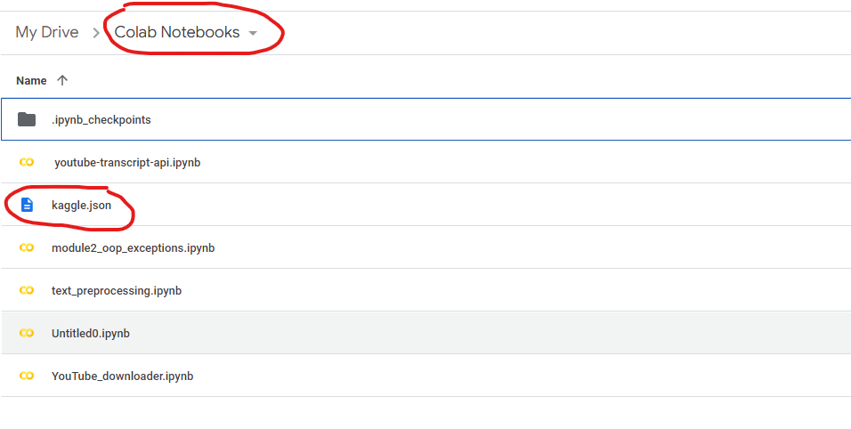
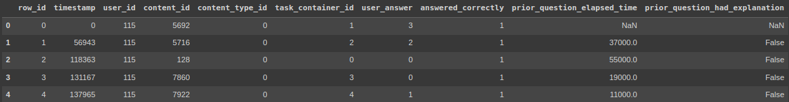
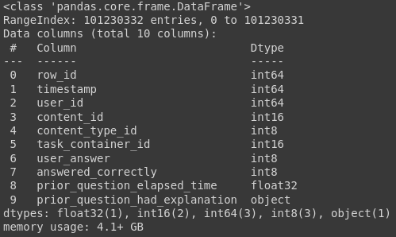
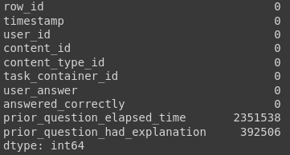
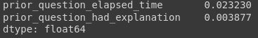

<table><tr><th>


</th>
<th>


</th>
</table>

# Pyspark. Анализ больших данных, когда Pandas не достаточно

Pandas - одна из наиболее используемых библиотек Python с открытым исходным кодом для работы со структурированными табличными данными для анализа. Библиотека Pandas активно используется для аналитики данных, машинного обучения, проектов в области науки о данных и многих других.

Однако он не поддерживает распределенную обработку, поэтому вам всегда придется увеличивать ресурсы, когда вам понадобится дополнительная мощность для поддержки растущих данных.

Проще говоря, Pandas выполняет операции на одной машине, в то время как PySpark работает на нескольких машинах. Если вы работаете над приложением машинного обучения, где вы имеете дело с большими наборами данных, PySpark является лучшим вариантом, который может обрабатывать операции во много раз (100x) быстрее, чем Pandas.

Ну что же, приступим. Для начала скачаем необходимые наборы данных с kaggle. Инструкция по скачиванию данных в colab напрямую с kaggle ниже:  
https://www.kaggle.com/general/74235

1. Заходим в раздел Account на kaggle.com
2. Пролистываем вниз до подраздела API
3. Жмем кнопку Create New API Token, скачиваем файл kaggle.json
4. Далее этот файл можно сразу бросить в Files на Google Colab, но так как каждые 12 часов сессия Google Colab полностью обновляется, то я предпочитаю положить в директорию Colab Notebooks на Google Drive



Попробуем поиграться с датасетом [Riiid Answer Correctness Prediction](https://www.kaggle.com/c/riiid-test-answer-prediction)


Код ниже скачивает датасет, все нужные файлы после этого лежат в папке data.
```python

! pip install -q kaggle
from google.colab import drive
drive.mount('/content/drive')
! mkdir ~/.kaggle
! cp '/content/drive/MyDrive/Colab Notebooks/kaggle.json' ~/.kaggle/ # файл kaggle.json можно положить в любую папку в Drive, главное указать актуальный адрес в первом аргументе команды cp
! chmod 600 ~/.kaggle/kaggle.json
! kaggle competitions download -c 'riiid-test-answer-prediction'
! mkdir data
! unzip riiid-test-answer-prediction.zip -d data
```
Датасет, скажем так, не огромный, и, возможно, ресурсов Вашей машины вполне хватит и совместно с pandas. Поэтому я буду показывать пример на бесплатной версии Google Colab. В бесплатном режиме нам предоставлено не более 12 ГБ оперативной памяти и для нашего учебного случая этого как раз достаточно.

Для начала попробуем проанализировать наш датасет с помощью библиотеки pandas.

## 1. Pandas

```python
import pandas as pd

df_train = pd.read_csv('data/train.csv',
                        dtype={'content_id': 'int16',
                               'content_type_id': 'int8',
                               'task_container_id': 'int16',
                               'user_answer': 'int8',
                               'answered_correctly': 'int8',
                               'prior_question_elapsed_time': 'float32'})
```
Глянем на наши данные.
```python
df_train.head()
```


```python
df_train.info()
```


Как видим, данные нашей таблицы занимают чуть больше 4 ГБ оперативной памяти, что составляет примерно треть памяти, выделенной colab для нас.

Посмотрим, сколько в нашей таблице пустых значений.

```python
df_train.isna().sum()
```


```python
df_train[['prior_question_elapsed_time', 'prior_question_had_explanation']].isna().mean()
```


Имеем: в столбце prior_question_elapsed_time всего чуть более 2% пропусков, в prior_question_had_explanation и того меньше. Пробуем удалить их методом dropna библиотеки pandas и...

```python
df = df_train.dropna()
```
... получаем ошибку нехватки оперативной памяти.


 > Примечание. На самом деле, получить данную ошибок мы могли в самом начале, при чтении датасете. Для этого достаточно было бы применить метод read_csv с аргументами по-умолчанию. Тогда pandas присвоил бы каждому столбцу с числовыми данными либо тип int64, либо тип float64. А памяти они занимают немало

Там, где не справился pandas, прибегнем к помощи spark.

## 2. Pyspark
Установим pyspark и pyarrow. Pyarrow значительно ускоряет работу pyspark, что в нашем случае очень пригодится
```puthon
! pip install pyspark
! pip install pyarrow
```
```python
from pyspark.sql import SparkSession
import os
os.environ["PYARROW_IGNORE_TIMEZONE"] = "1" # без этой строчки у нас будет возникать постоянное предупреждение с просьбой установить эту переменную в значение 1, что мы заранее и делаем


spark = SparkSession.builder.getOrCreate()
spark.conf.set("spark.sql.execution.arrow.pyspark.enabled", "true") # НАПИСАТЬ ПРО pyarrow
spark
```


Давайте прочтем наш файл и глянем, какие колонки присутствуют в нашей таблице. Если мы уверены, что у нас в каждой колонке присутствует один конкретный тип данных, можно установить параметр inferSchema=True, spark самостоятельно определит типы для каждой колонки.

```python
df = spark.read.csv('data/train.csv', header=True, inferSchema=True)

df.printSchema()
```


Для того, чтобы глянуть на данные, в pyspark есть метод show
```python
df.show()
```

```python
from pyspark.sql.types import IntegerType

df = df.withColumn('prior_question_had_explanation', df['prior_question_had_explanation'].cast(IntegerType()))
df.printSchema()
```


Посмотрим, сколько в нашей таблице пустых значений
```python
df.pandas_api().isna().mean() # выведем процентное соотношение
```


Ввиду малого количества пропущенных значений, проще их удалить, что мы и сделаем
```python
df = df.dropna()
df.pandas_api().isna().sum()
```


Проанализируем характеристики, влияющие на успеваемость студентов. Так как фактически данные об успеваемости у нас отсутствуют, условно за успеваемость будут выступать правильно данные ответы.      
Сначала сохраним колонку answered_correctly в переменную target. Это будет наша целевая переменная  
Затем рассчитаем коэффициент корреляции целевой переменной с каждой из остальных характеристик

```python
from pyspark.ml.stat import Correlation
from pyspark.ml.feature import VectorAssembler
import pandas as pd

# convert to vector column first
vector_col = "corr_features"
assembler = VectorAssembler(inputCols=df.columns, outputCol=vector_col)
df_vector = assembler.transform(df).select(vector_col)

# get correlation matrix
matrix = Correlation.corr(df_vector, vector_col)

cor_np = matrix.collect()[0][matrix.columns[0]].toArray()

corr_matrix_df = pd.DataFrame(data=cor_np, columns = df.columns, index=df.columns)
```

Выведем корреляционную матрицу на экран
```python
import seaborn as sns 
import matplotlib.pyplot as plt
plt.style.use('seaborn')

# plt.figure(figsize=(16,5))  
sns.heatmap(corr_matrix_df, 
            xticklabels=corr_matrix_df.columns.values,
            yticklabels=corr_matrix_df.columns.values,  cmap="Greens", annot=True)
plt.show()
```

