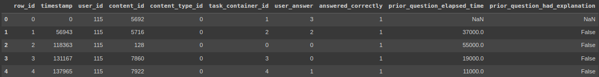
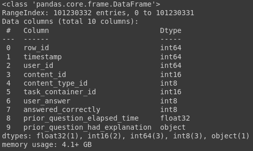
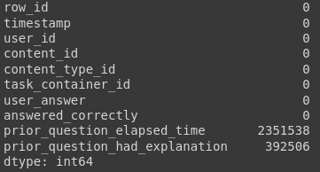

<table><tr><th>


</th>
<th>


</th>
</table>

# Pyspark. Анализ больших данных, когда Pandas не достаточно

Pandas - одна из наиболее используемых библиотек Python с открытым исходным кодом для работы со структурированными табличными данными для анализа. Однако он не поддерживает распределенную обработку, поэтому вам всегда придется увеличивать ресурсы, когда вам понадобится дополнительная мощность для поддержки растущих данных. И всегда наступит момент, когда ресурсов станет недостаточно. В данной статье мы рассмотрим, как PySpark выручает в условиях нехватки мощностей для обработки данных.

Ну что же, приступим. Для начала скачаем необходимые наборы данных с kaggle. Инструкция по скачиванию данных в colab напрямую с kaggle ниже:

1. Заходим в раздел Account на kaggle.com
2. Пролистываем вниз до подраздела API
3. Жмем кнопку Create New API Token, скачиваем файл kaggle.json
4. Далее этот файл можно сразу бросить в Files на Google Colab, но так как каждые 12 часов сессия Google Colab полностью обновляется, то я предпочитаю положить в директорию Colab Notebooks на Google Drive


> (https://www.kaggle.com/general/74235) - инструкция подробнее

Попробуем поэкспериментировать с датасетом [Riiid Answer Correctness Prediction](https://www.kaggle.com/c/riiid-test-answer-prediction)


Код ниже скачивает датасет, все нужные файлы после этого лежат в папке data.
```python

! pip install -q kaggle
from google.colab import drive
drive.mount('/content/drive')
! mkdir ~/.kaggle
! cp '/content/drive/MyDrive/Colab Notebooks/kaggle.json' ~/.kaggle/ # файл kaggle.json можно положить в любую папку в Drive, главное указать актуальный адрес в первом аргументе команды cp
! chmod 600 ~/.kaggle/kaggle.json
! kaggle competitions download -c 'riiid-test-answer-prediction'
! mkdir data
! unzip riiid-test-answer-prediction.zip -d data
```
Датасет, скажем так, не огромный, и, возможно, ресурсов вашей машины вполне хватит и для работы с pandas. Поэтому я буду показывать пример на бесплатной версии Google Colab. В бесплатном режиме нам предоставлено не более 12 ГБ оперативной памяти и для нашего учебного случая это как раз то, что нужно.

Для начала попробуем проанализировать наш датасет с помощью библиотеки pandas.

## 1. Pandas

```python
import pandas as pd

df_train = pd.read_csv('data/train.csv',
                        dtype={'content_id': 'int16',
                               'content_type_id': 'int8',
                               'task_container_id': 'int16',
                               'user_answer': 'int8',
                               'answered_correctly': 'int8',
                               'prior_question_elapsed_time': 'float32'})
```
Взглянем на наши данные.
```python
df_train.head()
```



```python
df_train.info()
```



Как видим, данные нашей таблицы занимают чуть больше 4 ГБ оперативной памяти, что составляет примерно треть памяти, выделенной colab для нас.

Посмотрим, сколько в нашей таблице пустых значений.

```python
df_train.isna().sum()
```



```python
df_train[['prior_question_elapsed_time', 'prior_question_had_explanation']].isna().mean()
```


Имеем: в столбце prior_question_elapsed_time всего чуть более 2% пропусков, в prior_question_had_explanation и того меньше. Пробуем удалить их методом dropna библиотеки pandas и...

```python
df = df_train.dropna()
```
... получаем ошибку нехватки оперативной памяти.


 > Примечание. На самом деле, получить данную ошибку мы могли в самом начале, при чтении датасете. Для этого достаточно было бы применить метод read_csv с аргументами по-умолчанию. Тогда pandas присвоил бы каждому столбцу с числовыми данными либо тип int64, либо тип float64. А памяти они занимают немало...

Там, где не справился pandas, прибегнем к помощи pyspark.

## 2. Pyspark
Установим pyspark и pyarrow. Pyarrow значительно ускоряет работу pyspark, что в нашем случае очень пригодится
```puthon
! pip install pyspark
! pip install pyarrow
```
```python
from pyspark.sql import SparkSession
import os
os.environ["PYARROW_IGNORE_TIMEZONE"] = "1" # без этой строчки у нас будет возникать постоянное предупреждение с просьбой установить эту переменную в значение 1, что мы заранее и делаем


spark = SparkSession.builder.getOrCreate()
spark.conf.set("spark.sql.execution.arrow.pyspark.enabled", "true")
spark
```


Давайте прочтем наш файл и посмотрим, какие колонки присутствуют в нашей таблице. Если мы уверены, что у нас в каждой колонке присутствует один конкретный тип данных, можно установить параметр inferSchema=True, pyspark самостоятельно определит типы для каждой колонки.

```python
df = spark.read.csv('data/train.csv', header=True, inferSchema=True)

df.printSchema()
```


Для просмотра данных в pyspark есть метод show
```python
df.show()
```


Прежде, чем заниматься пропусками, необходимо привести данные столбца prior_question_had_explanation к целочисленному типу 

```python
from pyspark.sql.types import IntegerType

df = df.withColumn('prior_question_had_explanation', df['prior_question_had_explanation'].cast(IntegerType()))
df.printSchema()
```


Посмотрим, сколько в нашей таблице пустых значений. Метод pandas_api преобразует существующий DataFrame в pandas-on-Spark DataFrame (это доступно только в том случае, если pandas установлен и доступен).
```python
df.pandas_api().isna().mean() # выведем процентное соотношение
```


На этот раз удалить пропущенные данные удается без проблем.
```python
df = df.dropna()
df.pandas_api().isna().sum()
```


Теперь рассмотрим как с помощью pyspark можно вывести на экран матрицу корреляции.

### Матрица корреляции.

Метод corr класса Correlation работает только с векторными столбцами. Поэтому прежде создания корреляционной матрицы необходимо применить преобразование датасета с помощью [VectorAssembler](https://spark.apache.org/docs/3.1.3/api/python/reference/api/pyspark.ml.feature.VectorAssembler.html)
> Из [документации](https://spark.apache.org/docs/latest/api/python/reference/api/pyspark.ml.stat.Correlation.html): column - имя столбца векторов, для которого необходимо вычислить коэффициент корреляции. Это должен быть столбец набора данных, и он должен содержать <u>объекты Vector</u>.

```python
from pyspark.ml.stat import Correlation
from pyspark.ml.feature import VectorAssembler
import pandas as pd

# сначала преобразуем данные в объект типа Vector
vector_col = "corr_features"
assembler = VectorAssembler(inputCols=df.columns, outputCol=vector_col)
df_vector = assembler.transform(df).select(vector_col)

# получаем матрицу корреляции и тут же преобразуем данные в numpy вектор
matrix = Correlation.corr(df_vector, vector_col).collect()[0][matrix.columns[0]].toArray() # запаситесь попкорном, данное действие, к сожалению не быстрое
corr_matrix_df = pd.DataFrame(data=matrix, columns = df.columns, index=df.columns) # последний штрих - оборачиваем полученную корреляционную матрицу в pandas DataFrame
```

Выводим корреляционную матрицу на экран
```python
import seaborn as sns 
import matplotlib.pyplot as plt
plt.style.use('seaborn')

# plt.figure(figsize=(16,5))  
sns.heatmap(corr_matrix_df, 
            xticklabels=corr_matrix_df.columns.values,
            yticklabels=corr_matrix_df.columns.values,  cmap="Greens", annot=True)
plt.show()
```


Как видите, pyspark позволил справиться с объемом данных, для которого всеми любимого pandas оказалось уже недостаточно. Причем синтаксис pyspark местами очень схож с pandas. А там, где методов чистого pyspark не хватает, на помощь приходит метод pandas_api
